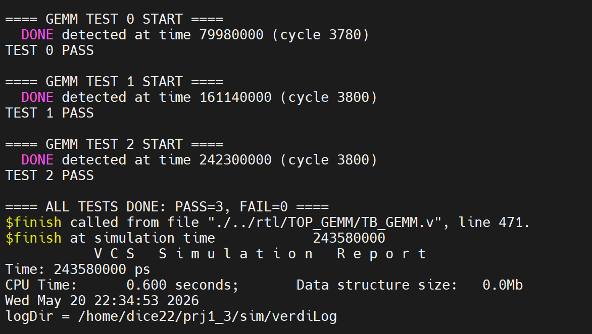

# RISC-V Processor for 8×8 GEMM

**과목/분야**: 디지털회로모델링및실험 (2인 팀)
**기간**: [추가 정보 필요]
**사용 도구**: Verilog HDL, Synopsys Design Compiler (SAED32 HVT), VCS/Verdi, Python (assembler)

📄 보고서: [docs/RISCV_8x8_GEMM_Report.pdf](docs/RISCV_8x8_GEMM_Report.pdf) · 발표자료: [docs/RISCV_8x8_GEMM_Presentation.pdf](docs/RISCV_8x8_GEMM_Presentation.pdf)

## 개요
8×8 GEMM(General Matrix Multiplication, C = A×B)을 효율적으로 수행하도록 RISC-V 프로세서 개선
Datapath/control path와 assembly code를 함께 최적화하고, 설계 단계별 PPA(Performance, Power, Area) 분석

## 문제 정의
- A, B: 8-bit unsigned 8×8 행렬, C: 32-bit word
- **제약 조건**:
  - Top-level port(PC, INSTR, MEMWRITE, ALURESULT, WRITEDATA, READDATA) 변경 금지
  - 외부 GEMM accelerator 금지
  - Custom instruction(MUL 포함) 금지
  - Memory map 유지: A = 0x000, B = 0x100, C = 0x200, STATUS = 0x300
  - 완료 시 STATUS에 1 저장 → testbench가 golden model과 비교

## 설계 및 구현
**Microarchitecture**
- **5-stage pipeline** (IF/ID/EX/MEM/WB): `DATAPATH.v`
- **Branch prediction + flush**: IF에서 예측, EX에서 mispredict 또는 JAL이면 flush 후 올바른 PC로 복구(`BRANCH_PRED.v`)
- **Forwarding unit 제거**: `and` 3개를 `beq`보다 먼저 배치하는 instruction scheduling으로 명령어 간격 3 이상 확보. 그 결과 register file에서 최신 값을 바로 읽게 되어, ALU 입력 앞 mux를 critical path에서 제거
- **A/B 8-bit masking**: MEM stage에서 주소 < 0x200이면 `{24'b0, READDATA[7:0]}`. `lbu` 없이 8-bit 입력 처리
- **ALU 축소**: ADD/SUB/AND만 남기고 OR/SLT/shift 제거(alucontrol 2-bit)
- **Branch predictor 최적화**: 데이터 의존적인 B-bit 검사 분기는 예측 대상에서 제외하고 루프 분기만 예측. PHT 64 → 32 entry, LHIST 2 → 1 bit로 줄여 predictor storage 160 → 80 bit(50%↓)

**Assembly**
- **Bit 기반 shift-add**: B의 bit mask를 검사하고, `add x8,x8,x8`로 A를 2배씩 증가. MUL 없이 RV32I subset만으로 곱셈 구현
- **4×4 tile**: x16~x31의 16개 register를 누산기로 사용해 tile 단위로 누적한 뒤 한 번에 저장(memory 접근 감소)
- Pointer arithmetic, register reuse

## 결과
**PPA (보고서 표 기준)**
| 구조 | Clock Period | Power | Area | Avg. Cycle | Exec. Time | Energy |
|---|---|---|---|---|---|---|
| Shift-add 적용 | 3.0 ns | 3.36 mW | 31186.1 | 12856 | 38 μs | 129 nJ |
| 4×4 tile 적용 | 3.0 ns | 3.63 mW | 35110 | 3704 | 11.1 μs | 40.5 nJ |
| Instruction 재배치 / forwarding 제거 | 2.55 ns | 4.16 mW | 34272.76 | 3793 | 9.67 μs | 40.3 nJ |
| **Branch predictor 최적화 (최종)** | **2.40 ns** | **4.13 mW** | **32421.42** | **3793** | **9.10 μs** | **37.6 nJ** |

> 보고서 본문(5장·8장)에는 최종 PPA가 clock 2.55 ns, power 3.92 mW, area 32291.44, 9.67 μs, 37.9 nJ로 기재되어 표와 다름. 포함된 합성 리포트 `src/syn/area.rpt`의 Total area(32421.42)는 표의 최종 행과 일치

- 합성 리포트: [`src/syn/area.rpt`](src/syn/area.rpt), [`src/syn/power.rpt`](src/syn/power.rpt), 제약: [`src/syn/RISCVMULTI.sdc`](src/syn/RISCVMULTI.sdc)
- 시뮬레이션 결과:



## 코드 구성
```
src/rtl/
├── RISCVMULTI.v      # CPU core top (외부 메모리 인터페이스)
├── DATAPATH.v        # 5-stage pipeline, branch/flush, masking
├── CONTROLLER.v, MAINDEC.v, ALUDEC.v
├── alu.v, REGFILE.v, EXTEND.v, FORWARD.v, BRANCH_PRED.v, IMEM_PC.v
├── my_gemm8x8.txt    # GEMM 프로그램 machine code (hex)
└── TOP_GEMM/
    ├── TOP_GEMM.v, DMEM.v, IMEM_PC.v   # 검증용 wrapper
    ├── TB_GEMM.v                        # testbench
    ├── my_gemm8x8.s                     # GEMM assembly
    └── assembler.py                     # RV32I(+M) assembler (.s → .hex)
src/syn/              # Design Compiler report / SDC
```

## 배운 점 / 의의
- 범용 RV32I 전체 지원 대신 워크로드에 필요한 subset만 남기고, assembly 배치와 microarchitecture를 함께 최적화. 그 결과 energy를 약 1/3 수준으로 감소
- Instruction scheduling은 stall·forwarding을 줄이는 대신 assembly와 하드웨어의 결합도를 높임. 범용성과 성능/면적 사이의 trade-off를 정량적으로 확인
